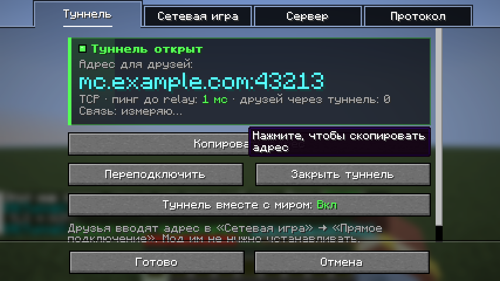
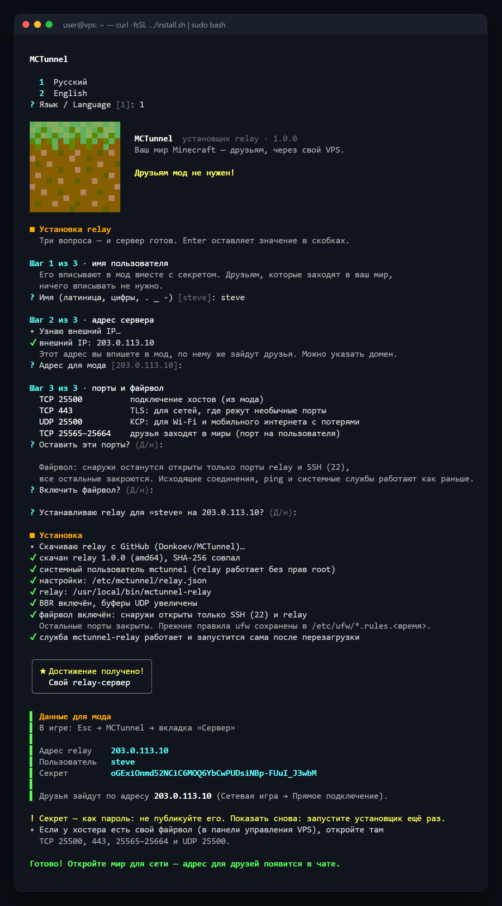
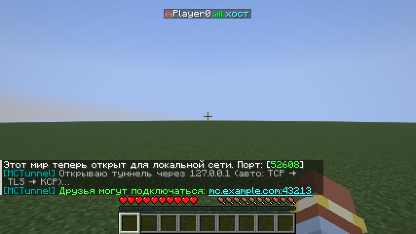
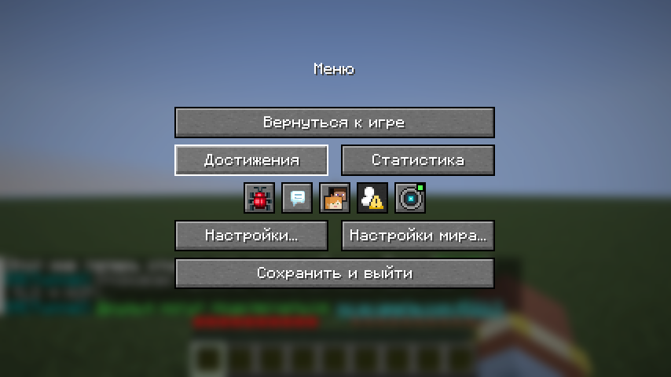
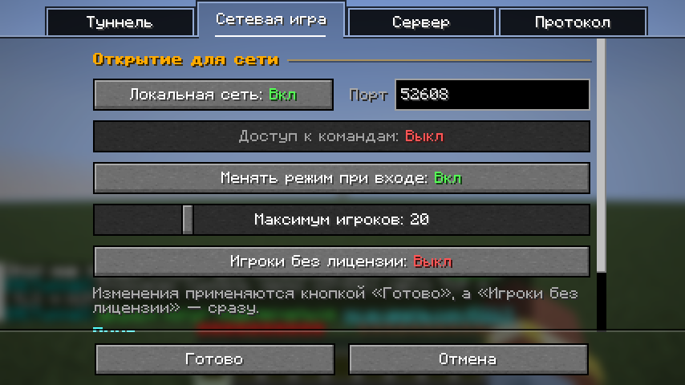
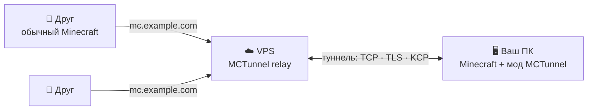

<div align="center">

# MCTunnel

**Откройте свой мир Minecraft друзьям через собственный VPS.**<br>
Без белого IP, без проброса портов и без модов у друзей.

[](https://github.com/Donkoev/MCTunnel/releases/latest)


[](LICENSE)

[Быстрый старт](#-быстрый-старт) · [Возможности](#-возможности) · [Как это работает](#-как-это-работает) · [Документация relay](docs/RELAY.md)



</div>

---

## 🎯 Зачем

Кнопка «Открыть для сети» работает только в локальной сети. Чтобы друг из другого города зашёл
в ваш мир, нужен белый IP и проброшенный порт, а провайдеры всё чаще выдают серый адрес за CGNAT,
где проброс невозможен. Обычные обходы — VPN-программы, которые ставит каждый друг, или туннели
через чужие серверы.

MCTunnel решает это через **ваш собственный** недорогой VPS. Мод на вашем ПК сам подключается к
relay-серверу, relay выдаёт постоянный адрес, и друзья заходят по нему **обычным клиентом
Minecraft**. Сервер ваш, адрес ваш, пинг зависит только от вас и VPS.

Проект состоит из двух частей:
- **relay** — сервер на VPS. В этом репозитории: его исходный код на Go, установщик одной
  командой и документация; готовые файлы — в [релизах](https://github.com/Donkoev/MCTunnel/releases);
- **мод для Fabric** — ставится только хосту, публикуется на Modrinth.

## ✨ Возможности

- 🟢 **Одна кнопка.** Esc → MCTunnel → «Открыть мир для друзей»: адрес появляется в чате, клик
  копирует его.
- 🧩 **Друзьям ничего не нужно.** Обычный Minecraft, «Сетевая игра» → «Прямое подключение».
- 🔌 **Три протокола с автовыбором.** TCP — для всех; TLS на порту 443 проходит там, где режут
  необычные порты; KCP поверх UDP держит пинг ровным на Wi-Fi и мобильном интернете с потерями.
  Если связь начинает подвисать, мод сам переходит на KCP.
- 🛡️ **Безопасно.** Взаимная авторизация по HMAC-SHA256: секрет не передаётся по сети и не
  лежит в папке игры, так что в сборку для друзей он не попадёт. Relay работает без прав root в
  песочнице systemd и банит перебор паролей.
- 🧭 **Обход VPN.** Если на ПК включён VPN, который забирает весь трафик, мод подключается к relay
  мимо него, напрямую через роутер.
- 📶 **Живой пинг в Tab.** Цифрами в миллисекундах, обновляется каждую секунду, в том числе у
  друзей без мода.
- 👥 **До 100 игроков** вместо ванильных 8. По желанию — «Игроки без лицензии».
- 🏠 **Один relay на всех.** У каждого, кто хостит, свой пользователь, секрет и постоянный адрес
  для друзей.
- ⚡ **Relay ставится одной командой.** Интерактивный установщик в стиле Minecraft: три вопроса —
  и сервер готов.
- 🔒 **Лишние порты закрыты.** Установщик включает файрвол: снаружи открыты только порты relay и
  SSH, а что ещё слушало порты, он покажет и предложит оставить.
- 🪶 **Лёгкий relay.** Один бинарник на Go, только стандартная библиотека; хватает 1 vCPU и
  512 МБ памяти.

## 🚀 Быстрый старт

### 1. Relay на VPS

Нужен VPS на Linux с systemd (Ubuntu, Debian и т. п.) и публичным IPv4. Подключитесь к нему по
SSH и выполните:

```bash
curl -fsSL https://github.com/Donkoev/MCTunnel/releases/latest/download/install.sh | sudo bash
```



Установщик сначала спросит язык (русский или английский), затем имя пользователя, адрес
сервера и порты (Enter оставляет стандартные),
скачает relay, проверит контрольную сумму, запустит службу, закроет файрволом все порты, кроме
нужных relay и SSH, и выдаст **данные для мода**: адрес, пользователя и секрет. Повторный запуск той же команды открывает меню: обновить relay, добавить
или удалить пользователя, показать данные ещё раз.

> [!NOTE]
> Если у хостера есть свой файрвол в панели управления VPS, откройте там порты, которые назовёт
> установщик: по умолчанию TCP 25500, 443, 25565–25664 и UDP 25500.

### 2. Мод на вашем ПК

1. Установите [Fabric Loader](https://fabricmc.net/use/) **0.19.5+** для Minecraft **26.3**.
2. Положите в папку `mods/` [Fabric API](https://modrinth.com/mod/fabric-api) **0.161.0+26.3** и
   мод MCTunnel с Modrinth.
3. Зайдите в свой мир, нажмите **Esc** → значок туннеля → вкладка **«Сервер»**, впишите данные
   из установщика и нажмите **«Готово»**.

### 3. Играйте

Esc → MCTunnel → **«Открыть мир для друзей»**. В чате появится адрес вроде
`mc.example.com` — друзья вводят его в «Сетевая игра» → «Прямое подключение».

## 🖼️ Как это выглядит

| | |
|:---:|:---:|
|  |  |
| Адрес для друзей в чате, пинг в Tab | Кнопка в меню паузы, лампочка — состояние туннеля |
|  |  |
| Вкладка «Туннель»: адрес, протокол, качество связи | «Сетевая игра»: LAN, лимит игроков, пинг |

## 🔧 Как это работает



1. Мод на вашем ПК **сам** подключается к relay: соединение исходящее, поэтому серый IP и CGNAT
   ему не мешают. Relay проверяет пользователя и секрет и выдаёт порт для друзей.
2. Друг подключается к VPS по этому адресу. Relay просит мод открыть отдельное соединение для
   этого игрока и склеивает их: дальше байты идут напрямую, без разбора.
3. Мод передаёт соединение в ваш мир, как будто друг в вашей локальной сети. Закрыли мир —
   туннель закрылся, порт освободился.

## 📋 Требования

| | |
|---|---|
| Minecraft | Java Edition 26.3 |
| Загрузчик | Fabric Loader 0.19.5+ и Fabric API 0.161.0+26.3 (только у хоста) |
| VPS | Linux с systemd, amd64 или arm64, публичный IPv4; 1 vCPU и 512 МБ хватает |
| Друзья | любой клиент Minecraft Java 26.3, модов не нужно |

## 🗂️ Что в этом репозитории

```
MCTunnel/
├── cmd/mctunnel-relay/   программа relay: запуск, проверка конфига, команды init и user
├── internal/
│   ├── protocol/         кадры протокола, авторизация HMAC-SHA256, коды ответов
│   ├── transport/        транспорты для хостов: TCP, TLS, KCP поверх UDP
│   ├── kcp/              KCP с окном по задержке
│   ├── relay/            туннели хостов, порты для друзей, склейка соединений, лимиты
│   ├── proxy/            перекачка данных между сокетами
│   ├── ratelimit/        баны за перебор секретов, лимит рукопожатий
│   └── config/           конфиг relay и его проверка
├── go.mod                только стандартная библиотека Go
├── install.sh            установщик relay (та самая одна команда)
├── deploy.ps1            установка relay с Windows по SSH, если сервер не открывает GitHub
├── relay.example.json    пример конфига relay со всеми полями
└── docs/
    ├── RELAY.md          установка и настройка relay, безопасность, решение проблем
    └── images/           скриншоты
```

Готовые файлы relay (Linux amd64 и arm64), установщик и архив для `deploy.ps1` лежат в
[релизах](https://github.com/Donkoev/MCTunnel/releases), рядом — `SHA256SUMS.txt`.

## 🛠️ Сборка из исходников

Нужен Go 1.22+. Relay собирается одной командой, зависимостей нет:

```bash
go build -o mctunnel-relay ./cmd/mctunnel-relay
```

Для VPS из Windows или macOS — статический бинарник под Linux. С такими флагами получается ровно
тот же файл, что в релизе, байт в байт (сверьте с `SHA256SUMS.txt`):

```bash
GOOS=linux GOARCH=amd64 CGO_ENABLED=0 go build -buildvcs=false -trimpath \
  -ldflags "-s -w -X main.version=1.0.0" -o mctunnel-relay-linux-amd64 ./cmd/mctunnel-relay
```

Положите бинарник рядом с `install.sh` и запустите на сервере `sudo bash install.sh`: установщик
возьмёт его вместо скачивания.

## 🏷️ Версии

**1.0.0 — первая версия relay и мода.** Следующие версии будут выходить по мере развития мода;
готовые файлы каждой версии — в [релизах](https://github.com/Donkoev/MCTunnel/releases).

## 📚 Документация

**[Relay: установка и настройка](docs/RELAY.md)** — установка одной командой и с Windows, меню
установщика, пользователи и секреты, все поля `relay.json`, установка вручную, безопасность,
решение проблем.

## 📄 Лицензия

[MIT](LICENSE) © 2026 Ramazan Donkoev. Relay содержит порт [KCP](https://github.com/skywind3000/kcp)
(MIT), подробности — в [THIRD_PARTY_NOTICES.md](THIRD_PARTY_NOTICES.md).

Minecraft — товарный знак Mojang AB. Проект не связан с Mojang и Microsoft.
